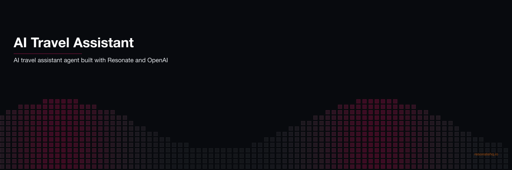

<p align="center">
  
</p>

# AI travel assistant | Resonate example application

This example app shows how to create a travel assistant ai agent with Resonate and OpenAI's API.

## How to run the agent

Install dependencies:

```shell
uv sync
```

Run the agent:

```shell
uv run agent
```
