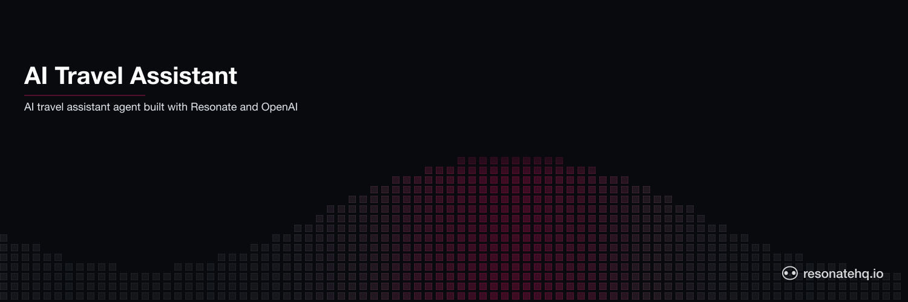

<p align="center">
  <picture>
    <source media="(prefers-color-scheme: dark)" srcset="./assets/banner-dark.png">
    <source media="(prefers-color-scheme: light)" srcset="./assets/banner-light.png">
    
  </picture>
</p>

# AI travel assistant | Resonate example application

This example app shows how to create a travel assistant ai agent with Resonate and OpenAI's API.

## How to run the agent

Install dependencies:

```shell
uv sync
```

Run the agent:

```shell
uv run agent
```
